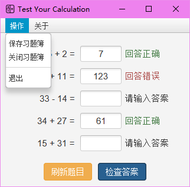

# Test Your Calculation (WIP)

软件构造 结课实验 加减法算式习题薄的设计与优化

注意：该项目使用了大量 Java 9 到 Java 17 的新特性，需要使用 JDK 17 进行编译。

## TODO

- [x] 设计加法、减法算式对应的实体类
- [x] 要求加法、减法相分离
- [x] 习题（算式集合）与算式相分离，习题中算式无重复
- [x] 算式产生与算式约束条件分离（100以内的加减法）
- [x] 对习题进行持久化，使用JSON离线存储
- [x] 设计习题的输出方式，使用 Java FX 进行界面设计
- [x] 用户可以完成习题
- [x] 用户可以对习题的完成结果进行检查
- [x] 设计测试用例，使用JUnit单元测试工具，对关键的程序逻辑进行自动化测试
- [x] 运用继承、多态等面向对象机制进行设计，运用抽象工厂、单实例、迭代器等设计模式重构优化代码

--- 

- [ ] 加入乘法、除法习题
- [ ] 多套习题
- [ ] 为系统设计菜单，设计错题薄，提供正确率统计功能
- [ ] 使用反射技术实现习题约束条件的动态加载（配置文件指明类名）

---

该项目已添加大部分文档注解，请在 IDEA 中勾选`渲染文档注解`选项以达到更好的代码浏览效果。

