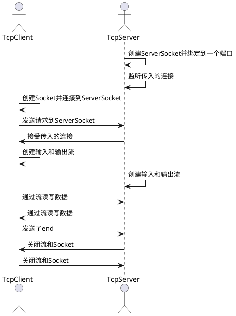

```
[Shape]<>--[Circle]
[Shape]<>--[Rectangle]
[Shape]<>--[Triangle]
[Shape]<|--[UnsupportedShapeException]
[Shape]
:+draw():void
:+erase():void
[ShapeFactory]
:+createShape(shapeType: String): Shape
[Circle]
:+draw():void
:+erase():void
[Rectangle]
:+draw():void
:+erase():void
[Triangle]
:+draw():void
:+erase():void
```
