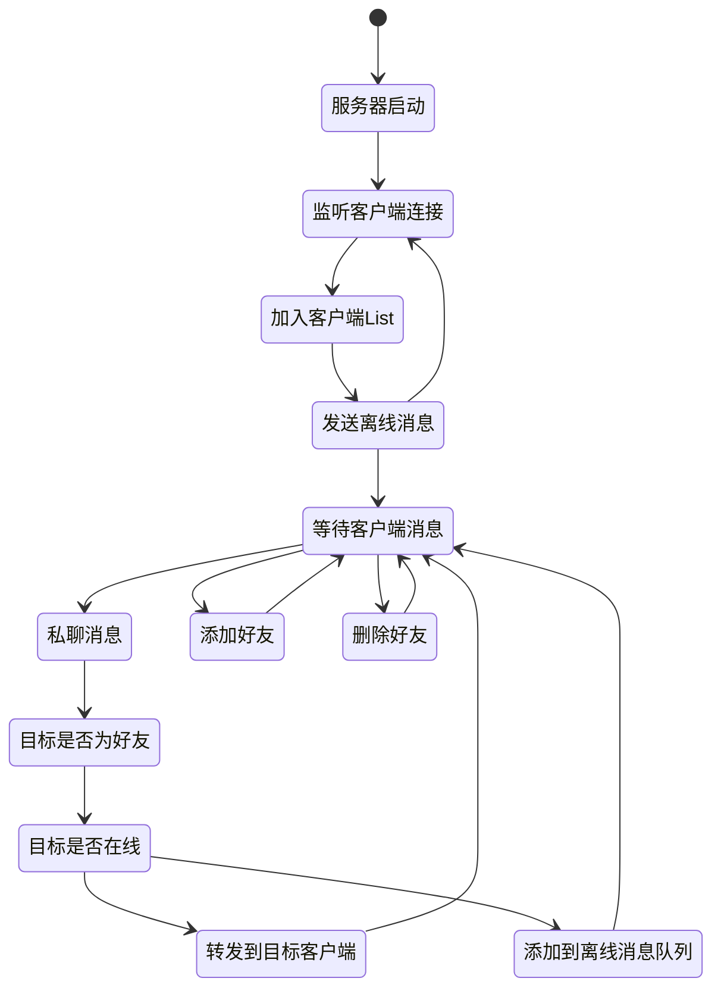

# 聊天室项目

## 功能模块

- [x] 第一次启动服务时造一些假数据
- [x] 用户登录
- [x] 添加/删除好友
- [x] 指定好友聊天
- [x] 离线消息

## 技术点

- socket 客户端/服务端
- I/O 流
- thread 线程
- Scanner

## 要求

- 类与包规范化(com.jb.client)
- 交作业(班级+学号+姓名) 例如:80班+1001+江波

## 数据库设计

### 用户表

- 学号
- 昵称
- 性别
- 出生年月
- 年龄
- 地区

### 好友表

- 学号1
- 学号2

## 设计思路

### 服务器

## 鸣谢

- https://blog.csdn.net/u014646643/article/details/107688805
