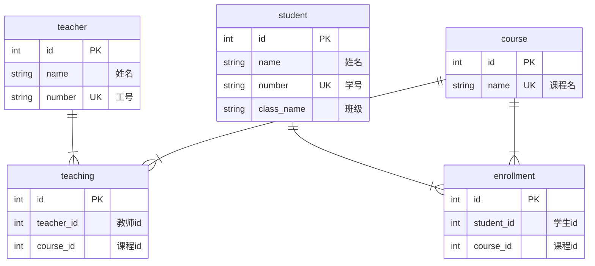

# Springboot 结课作业

经典的 **教师、学生、课程管理系统** 。

```mermaid
erDiagram
    teacher {
        int id PK
        string name "姓名"
        string number UK "工号"
    }
    student {
        int id PK
        string name "姓名"
        string number UK "学号"
        string class_name "班级"
    }
    course {
        int id PK
        string name UK "课程名"
    }

    teaching {
        int id PK
        int teacher_id "教师id"
        int course_id "课程id"
    }
    enrollment {
        int id PK
        int student_id "学生id"
        int course_id "课程id"
    }

    student ||--|{ enrollment : ""
    teacher ||--|{ teaching : ""
    course ||--|{ teaching : ""
    course ||--|{ enrollment : ""
```
