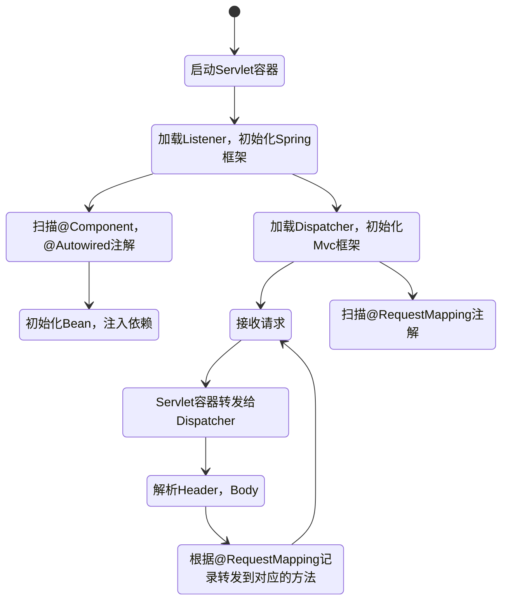

# 基于 WebSocket 的网络聊天室

扩展课中实验，
一个 B/S 架构的网络聊天室，使用 WebSocket 协议进行通信。

## 包含功能

- [ ] 用户登录
- [ ] 好友列表
- [ ] 好友添加
- [ ] 好友私聊
- [ ] 公屏聊天

## 技术点

- [x] 土制 日志 框架 （实现 Slf4j 接口）
- [x] 土制 Spring 框架 （IoC 容器、依赖注入）
- [ ] 土制 Spring MVC 框架 （MVC 框架）
- [ ] 土制 MyBatis 框架
- [ ] 将 `自制 MVC 框架` 整合到 `Servlet` 并接入 `Tomcat`
- [ ] ~~土制 WebSocket 框架 （基于 MVC 框架）~~
- [ ] ~~土制 数据库连接池 （连接池）~~
- [ ] ~~土制模板引擎 （视图解析器）~~
- [ ] ~~土制 HTTP 服务器 （Servlet 容器）~~
- [ ] ~~土制 Lombok 框架 （代码生成）~~

> 被划掉的技术点为非本实验重点，不做要求。

## 第三方依赖

- MySQL Connector/J （数据库驱动）
- Lombok （代码生成）
- Slf4j-api （日志门面）
- JUnit 5 （单元测试）
- Servlet-api （Servlet 接口）
- dom4j （XML 解析）
- jackson （JSON 序列化）

## 作业提交注意点

- 题目不限（前台、后台二选一）
- 编写实验报告
- 后端实现： **反射** 、 **注解** 、 **socket** 或 **tomcat**
- 前端实现： **HTML** 、 **CSS** 、 **JavaScript** 和 **jQuery**

## 鸣谢

- [Java注解：使用isAnnotationPresent(注解名.class)总是返回false](https://blog.csdn.net/sinat_36184075/article/details/105552817)
- [How do I make my logging framework SLF4J compatible?](https://www.slf4j.org/faq.html#slf4j_compatible)
- [获取指定包名下的所有类](https://blog.csdn.net/Leon_Jinhai_Sun/article/details/106344047)
- [Java9之后显示newInstance()已经过时](https://blog.csdn.net/m0_52402391/article/details/123781945)
- [@SneakyThrowsWhen use lombok ”@SneakyThrows“，unsupported class file major version 61](https://stackoverflow.com/questions/72854319/sneakythrowswhen-use-lombok-sneakythrows-unsupported-class-file-major-versio)
